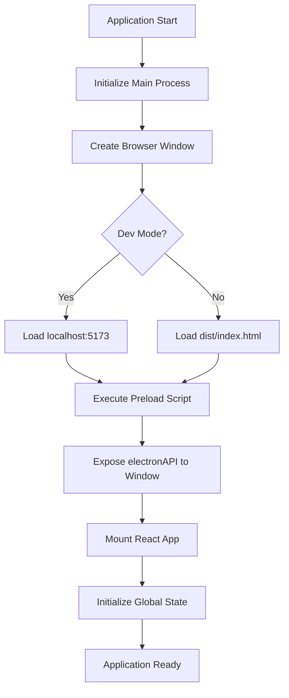
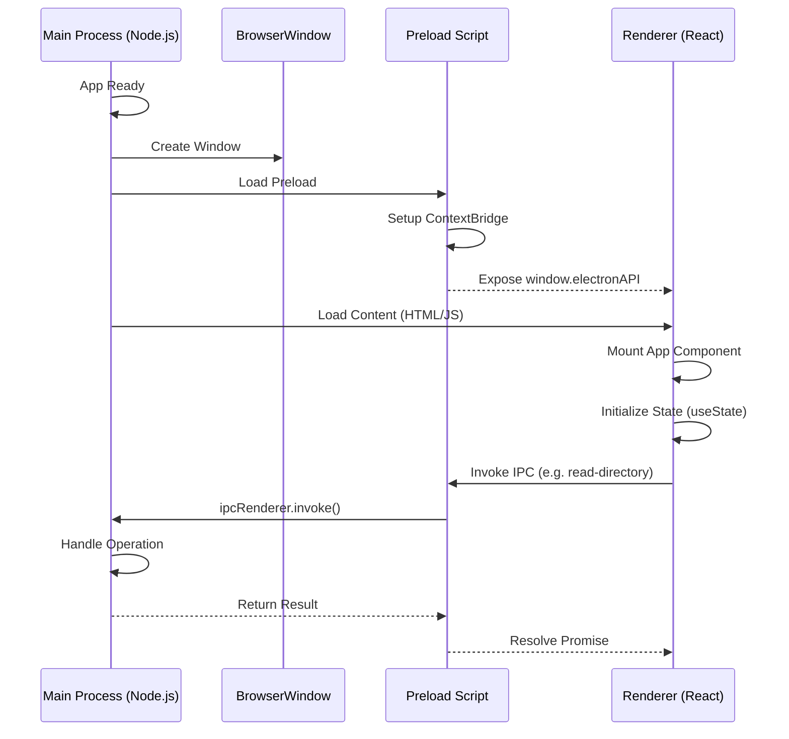
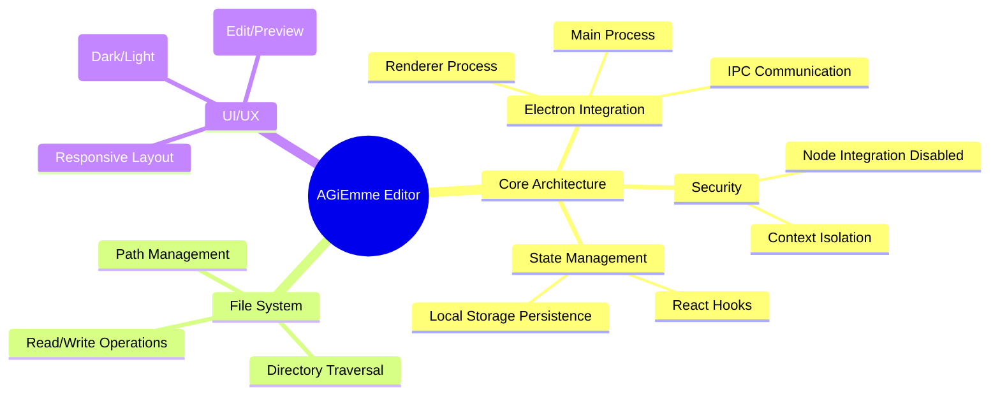

# Architecture Overview

## Descrizione
L'architettura di AGiEmme Editor è basata su **Electron**, che combina Chromium per il rendering dell'interfaccia utente e Node.js per le operazioni di sistema. Il progetto adotta il pattern di sicurezza raccomandato con **Context Isolation** e **Preload Scripts**.

## Scopo e Valore
Questa architettura garantisce:
- **Sicurezza**: Separazione tra codice UI e accesso al sistema operativo.
- **Performance**: UI reattiva grazie a React e gestione asincrona dei file.
- **Cross-Platform**: Unica codebase per macOS, Windows e Linux.

## Dettaglio del Comportamento
1. **Main Process**: Gestisce la creazione delle finestre e l'accesso al file system tramite `ipcMain`.
2. **Preload Script**: Espone un set limitato e sicuro di API (`window.electronAPI`) al Renderer.
3. **Renderer Process**: Esegue l'applicazione React, gestisce lo stato e l'interfaccia utente.

## Diagrammi

### Flowchart: Ciclo di Vita Applicazione

### Sequence Diagram: Inizializzazione e IPC

### Capability Map

