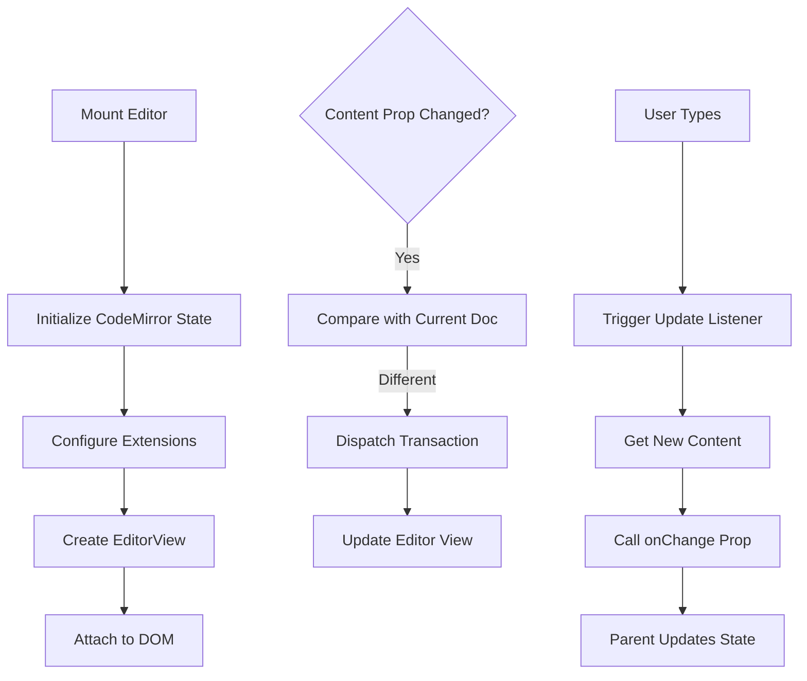
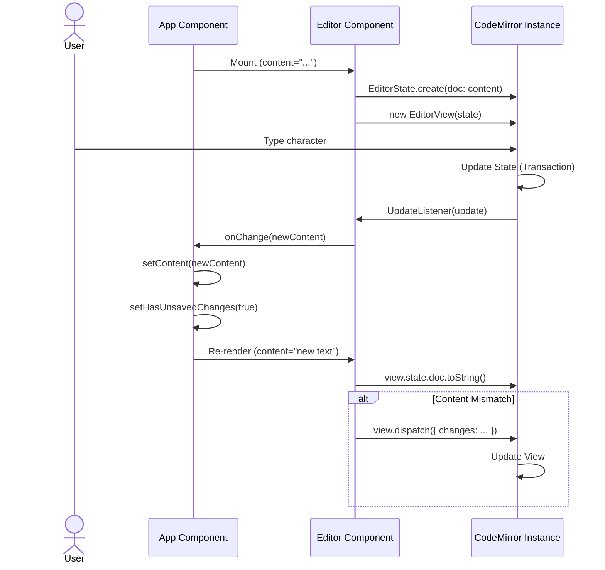
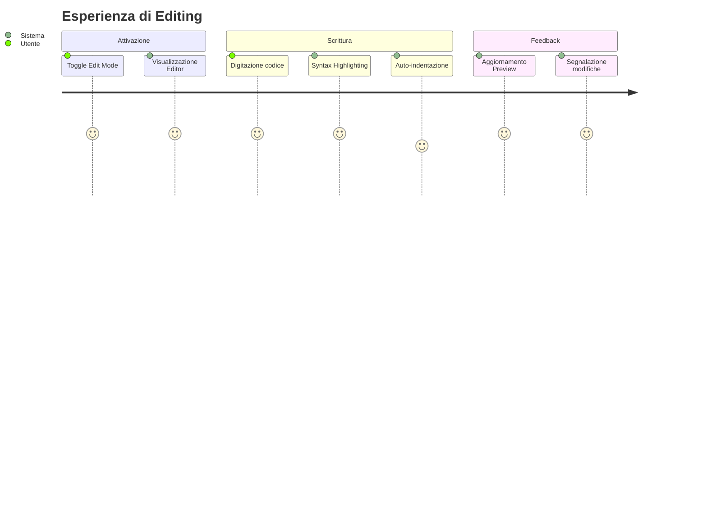

# Editor Component

## Descrizione
Il componente Editor integra **CodeMirror 6** per fornire un'esperienza di editing del codice moderna e performante. È configurato specificamente per il linguaggio Markdown, offrendo funzionalità come syntax highlighting e gestione delle modifiche in tempo reale.

## Scopo e Valore
Fornisce l'interfaccia principale per la creazione e la modifica dei contenuti. A differenza di una semplice textarea, offre strumenti visivi che aiutano l'utente a scrivere codice corretto e leggibile.

## Dettaglio del Comportamento

### Configurazione CodeMirror
- **Extensions**: `basicSetup`, `markdown()`, `EditorView.updateListener`.
- **Tema**: Personalizzato per adattarsi al design dell'applicazione (font monospaziato, padding, altezza).

### Sincronizzazione Bidirezionale
1. **User -> App**: Quando l'utente digita, un `UpdateListener` cattura le modifiche e invoca la callback `onChange` passata dal componente padre.
2. **App -> Editor**: Quando il contenuto cambia esternamente (es. caricamento file), un `useEffect` confronta il contenuto attuale dell'editor con la nuova prop e, se necessario, dispaccia una transazione di aggiornamento.

### Input / Output
- **Input**: Testo digitato dall'utente, prop `content` dal padre.
- **Output**: Callback `onChange` con il nuovo contenuto testuale.

## Esempi d'uso
- Digitare `# Titolo` per vedere l'evidenziazione della sintassi Markdown.
- Incollare codice Mermaid all'interno di blocchi di codice.

## Limitazioni
- Attualmente configurato solo per Markdown (non c'è highlighting specifico per Mermaid all'interno del blocco di codice, se non quello generico).
- Non supporta ancora autocompletamento avanzato.

## Diagrammi

### Flowchart

### Sequence Diagram

### User Journey

