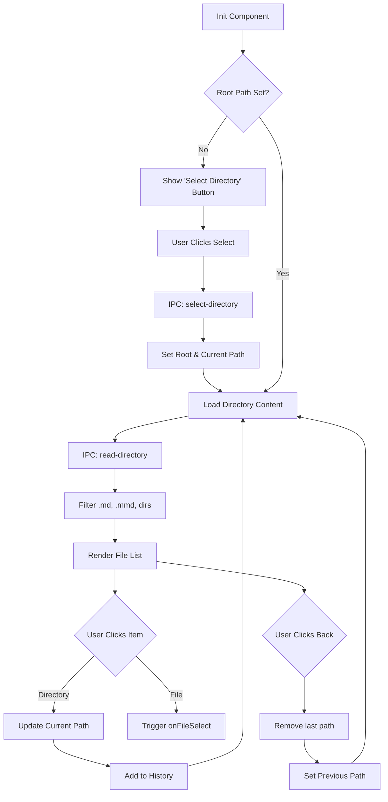
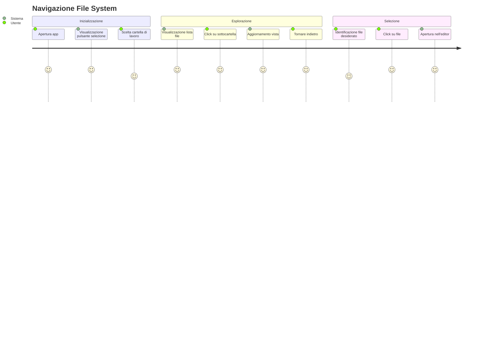

# File Explorer

## Descrizione
Il componente File Explorer fornisce un'interfaccia grafica per navigare nel file system locale. Permette di selezionare una directory di lavoro ("root"), esplorare le sue sottocartelle e visualizzare i file supportati.

## Scopo e Valore
Facilita l'accesso ai progetti e ai documenti senza dover lasciare l'applicazione. Filtra automaticamente i file non rilevanti, riducendo il rumore visivo e migliorando l'esperienza utente.

## Dettaglio del Comportamento

### Funzionalità
- **Selezione Root**: Imposta la cartella base per il progetto corrente.
- **Navigazione**: Drill-down nelle directory e navigazione a ritroso (breadcrumb/back button).
- **Filtraggio**: Mostra solo file `.md`, `.mmd`, `.mermaid` e directory.
- **History**: Mantiene traccia del percorso di navigazione per consentire il ritorno alle cartelle precedenti.
- **Creazione File**: Punto di accesso rapido per creare nuovi file nella directory corrente.

### Input / Output
- **Input**: Click utente su cartelle/file, selezione directory di sistema.
- **Output**: Lista di file renderizzata, evento di selezione file propagato al componente padre (`App`).

## Esempi d'uso
1. All'avvio, cliccare su "Seleziona Directory" per aprire la cartella dei documenti.
2. Cliccare su una cartella per entrarci.
3. Cliccare sul pulsante "←" per tornare al livello superiore.
4. Cliccare su un file `.md` per aprirlo nell'editor.

## Limitazioni
- Non supporta operazioni di file system avanzate (rinomina, elimina, sposta) dall'interfaccia.
- Non mostra file nascosti o non supportati.

## Diagrammi

### Flowchart


### Sequence Diagram
```mermaid
sequenceDiagram
    actor User
    participant FE as FileExplorer Component
    participant IPC as Electron API
    participant Main as Main Process
    participant FS as File System

    %% Select Root
    User->>FE: Click "Select Directory"
    FE->>IPC: selectDirectory()
    IPC->>Main: invoke('select-directory')
    Main->>User: Show Open Dialog
    User-->>Main: Select Folder
    Main-->>IPC: folderPath
    IPC-->>FE: folderPath
    FE->>FE: setRootPath(folderPath)
    
    %% Load Directory
    FE->>FE: loadDirectory(folderPath)
    FE->>IPC: readDirectory(folderPath)
    IPC->>Main: invoke('read-directory', folderPath)
    Main->>FS: fs.readdir(withFileTypes)
    FS-->>Main: entries
    Main->>Main: Filter & Sort
    Main-->>IPC: fileList
    IPC-->>FE: fileList
    FE->>FE: setItems(fileList)
    FE->>User: Render List

    %% Navigation
    User->>FE: Click Subfolder
    FE->>FE: setCurrentPath(subfolder)
    FE->>FE: addToHistory(subfolder)
    FE->>FE: loadDirectory(subfolder)
    ... (Repeat Load Directory) ...
```

### User Journey

