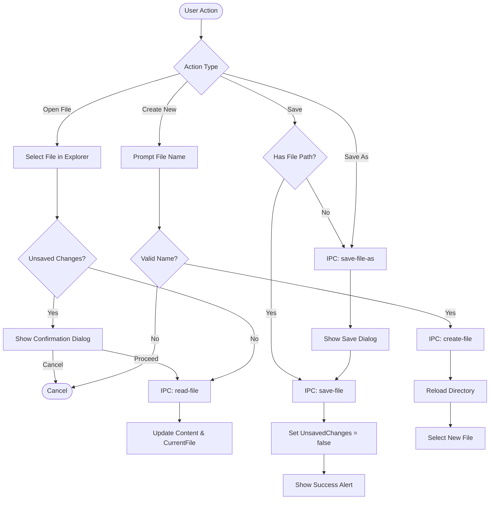
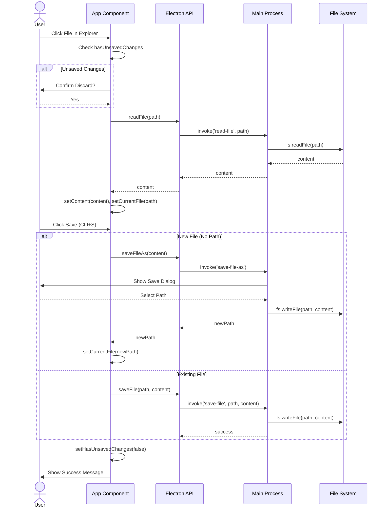
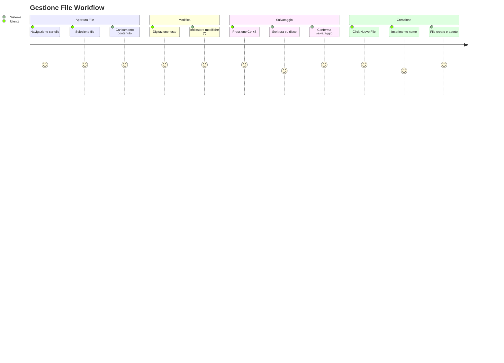

# File Management

## Descrizione
Il modulo di gestione file permette agli utenti di creare, aprire, leggere e salvare file Markdown (`.md`) e Mermaid (`.mmd`) all'interno dell'applicazione. Le operazioni sono gestite in modo sicuro tramite IPC.

## Scopo e Valore
Fornisce le funzionalità essenziali di un editor di testo, garantendo la persistenza dei dati e la gestione sicura degli accessi al disco. Include meccanismi di protezione contro la perdita accidentale di modifiche non salvate.

## Dettaglio del Comportamento

### Operazioni Supportate
- **Lettura**: Caricamento asincrono del contenuto dei file.
- **Scrittura**: Salvataggio del contenuto corrente su disco.
- **Salva con nome**: Creazione di nuovi file da contenuto esistente tramite dialog di sistema.
- **Creazione**: Generazione di nuovi file vuoti nella directory corrente.
- **Protezione**: Prompt di conferma se si tenta di chiudere/cambiare file con modifiche non salvate.

### Input / Output
- **Input**: Interazioni utente (click, shortcut tastiera), percorsi file, contenuto testuale.
- **Output**: Operazioni su file system, aggiornamenti di stato UI (titolo finestra, indicatori).

## Esempi d'uso
- Premere `Ctrl+S` per salvare rapidamente il lavoro.
- Cliccare su un file nel File Explorer per aprirlo.
- Usare il pulsante "+ Nuovo File" per creare un nuovo documento.

## Limitazioni
- Supporta solo codifica UTF-8.
- Non gestisce il locking dei file (concorrenza con altre app).

## Diagrammi

### Flowchart

### Sequence Diagram

### User Journey

