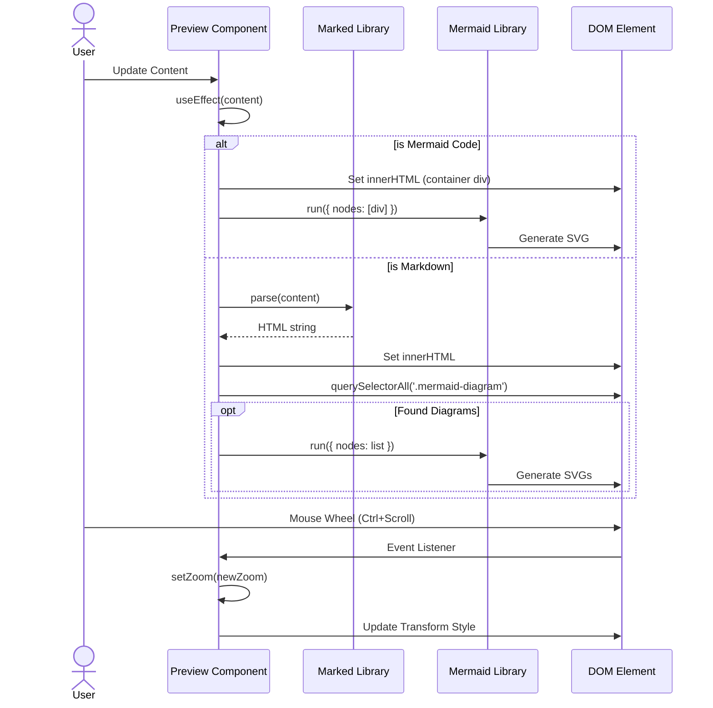

# Preview Component

## Descrizione
Il componente Preview è responsabile della visualizzazione del contenuto renderizzato. Supporta nativamente sia il formato Markdown che i diagrammi Mermaid, offrendo un'esperienza di visualizzazione fluida con funzionalità di Zoom e Pan.

## Scopo e Valore
Permette all'utente di vedere immediatamente il risultato finale del proprio lavoro. La capacità di renderizzare diagrammi Mermaid sia come file standalone che all'interno di blocchi di codice Markdown è una funzionalità chiave dell'applicazione.

## Dettaglio del Comportamento

### Rendering Ibrido
Il componente analizza il contenuto in ingresso per determinare la strategia di rendering:
1. **Mermaid Mode**: Se il contenuto inizia con parole chiave Mermaid (es. `graph`, `sequenceDiagram`), viene trattato come un diagramma puro.
2. **Markdown Mode**: Altrimenti, viene parsato come Markdown. Un renderer personalizzato per `marked` intercetta i blocchi di codice `mermaid` e li prepara per il rendering successivo.

### Controlli Viewport
- **Zoom**: Gestito tramite stato React (`zoom`). Modificabile via pulsanti UI o `Ctrl + Scroll`.
- **Pan**: Gestito tramite stato React (`pan {x,y}`). Attivato trascinando il mouse sulla canvas.
- **Reset**: Ripristina zoom a 100% e posizione (0,0).

### Gestione Errori
Cattura le eccezioni durante il parsing o il rendering (spesso dovute a sintassi Mermaid non valida) e mostra un messaggio di errore amichevole invece di crashare l'applicazione.

## Input / Output
- **Input**: Stringa di testo raw (Markdown o Mermaid).
- **Output**: DOM HTML/SVG visualizzato.

## Esempi d'uso
- Scrivere un diagramma di flusso per vederlo apparire istantaneamente.
- Usare la rotella del mouse tenendo premuto Ctrl per ingrandire un dettaglio del diagramma.

## Limitazioni
- Il rendering di diagrammi molto complessi potrebbe causare rallentamenti momentanei.
- Lo stile dei diagrammi è attualmente fissato al tema di default di Mermaid.

## Diagrammi

### Flowchart
```mermaid
flowchart TD
    Start[Receive Content] --> CheckEmpty{Is Content Empty?}
    CheckEmpty -- Yes --> RenderEmpty[Show Empty Message]
    CheckEmpty -- No --> CheckType{Is Mermaid?}
    
    CheckType -- Yes (starts with keyword) --> RenderMermaid[Render Mermaid Diagram]
    RenderMermaid --> RunMermaid[mermaid.run()]
    
    CheckType -- No (Markdown) --> ConfigMarked[Configure Marked Renderer]
    ConfigMarked --> ParseMD[Parse Markdown to HTML]
    ParseMD --> InjectHTML[Inject HTML into DOM]
    InjectHTML --> FindDiagrams[Find .mermaid-diagram elements]
    FindDiagrams --> RunMermaidMD[mermaid.run(nodes)]
    
    RunMermaid --> HandleError{Error?}
    RunMermaidMD --> HandleError
    HandleError -- Yes --> ShowError[Render Error Message]
    HandleError -- No --> Success[Display Content]
```

### Sequence Diagram

